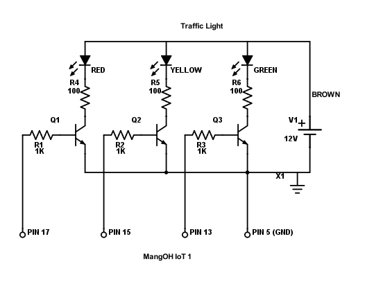

TrafficLight App
==================

### Description

TrafficLight App is primarily used to monitor the last complete build of any Jenkins job results. It 
polls a settable URL at a settable interval that can be displayed on the device configTree. 

This was developed using:
* legato version 16.10.3
* WP85 release 14
* [MangOH Green](http://mangoh.io/mangoh-green.html) + [IoT expansion card (for GPIO)](http://mangoh.io/documentation/iot_expansion_cards.html)
* [TrafficLight](https://www.adafruit.com/product/2993)
* 3x 2N3904 transistor
* 3x 1K Ohm resistor
* 3x 100 Ohm resistor

### Schematic Diagram

### Traffic Light States

exitCodeCheck | contentCodeCheck | HTTP Code | Light Output
:-------------|------------------|-----------|:-------------
     true     |       true       |    200    |  GetResult();
     true     |       true       |   !200    |  LIGHT_RED
     true     |       false      |    200    |  LIGHT_GREEN
     true     |       false      |   !200    |  LIGHT_RED
     false    |       true       |    N/A    |  GetResult();
     false    |       false      |    N/A    |  LIGHT_OFF

#### GetResult(); Function

Light Output  | Status
:-------------|:---------------------------
 LIGHT_GREEN  | SUCESS
 LIGHT_YELLOW | ABORTED
      "       | UNSTABLE
 LIGHT_RED    | FAILURE
      "       | NULL (cannot find keyword)