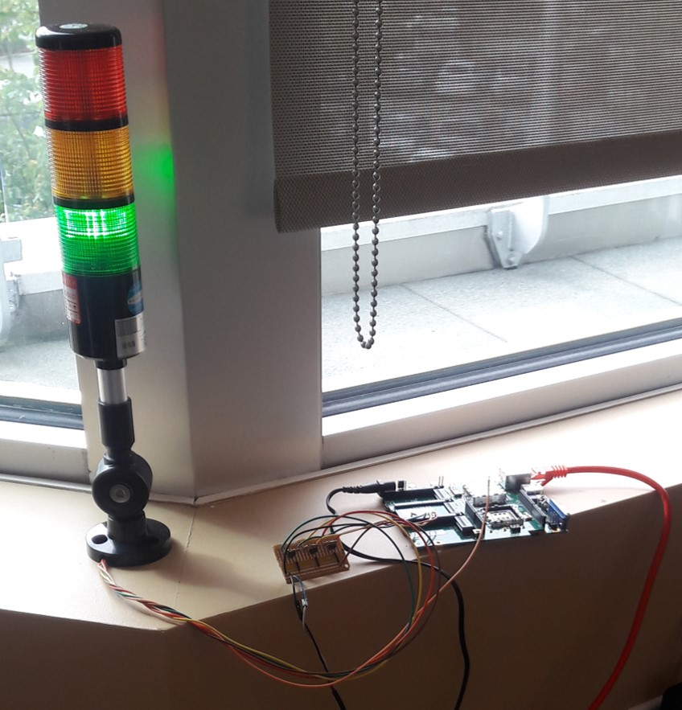

TrafficLight App
==================

### Description

TrafficLight App is primarily used to monitor the last complete build of any Jenkins job results.
It polls a settable URL at a settable interval that can be displayed on the device config tree or
LE_INFO logs. The user can toggle exitCodeCheck and contentCodeCheck in the config tree to individually
check the results of the HTTP Code, content result, or both (See States below).

This was developed using:
* Legato version 16.10.3
* WP85 release 14
* [MangOH Green](http://mangoh.io/mangoh-green) + [IoT expansion card (for GPIO)](http://mangoh.io/documentation/iot_expansion_cards.html)
* [Tower Light 3 colors - 12VDC](https://www.adafruit.com/product/2993)
* 3x 2N3904 transistor
* 3x 1K Ohm resistor
* 3x 100 Ohm resistor
* 12VDC 1A Power Supply

### Schematic Diagram

### States

exitCodeCheck | contentCodeCheck | HTTP Code | Light Output
:-------------|------------------|-----------|:-------------
 true         | true             | 200       | [contentState](#headin)
 true         | true             | !200      | LIGHT_RED
 true         | false            | 200       | LIGHT_GREEN
 true         | false            | !200      | LIGHT_RED
 false        | true             | N/A       | [contentState](#headin)
 false        | false            | N/A       | LIGHT_GREEN

#### contentState

Light Output  | Status
:-------------|:---------------------------
 LIGHT_GREEN  | SUCCESS
 LIGHT_YELLOW | ABORTED
 "            | UNSTABLE
 LIGHT_RED    | FAILURE
 "            | NULL (cannot find keyword)
 
 cURL ERROR also defaults to LIGHT_YELLOW for easy debugging issues
 
 ### Picture
 
 This is what it looks like in action! At the time of this picture, it was monitoring our merges and it seems like we are doing a good job :grinning:
 
